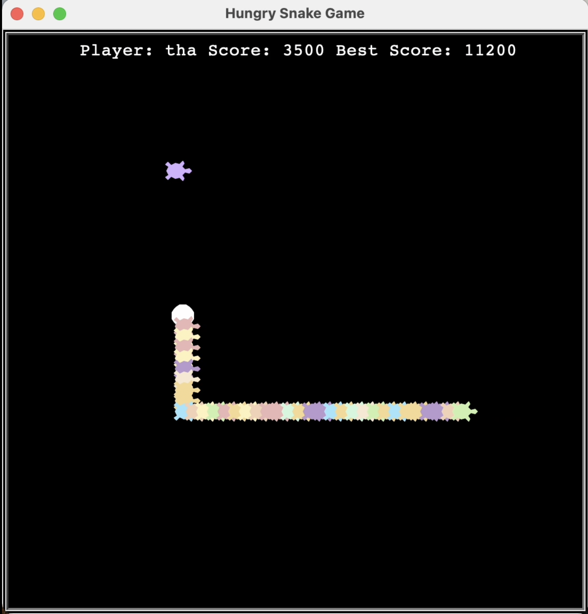
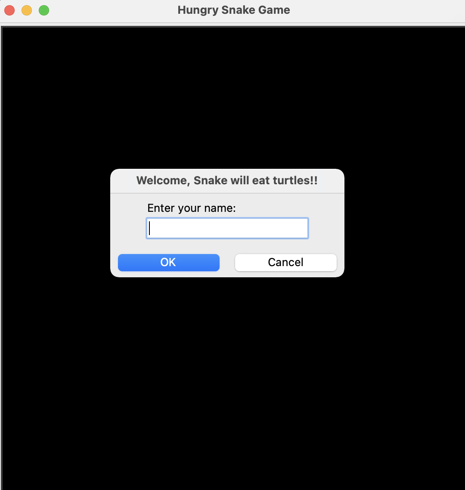
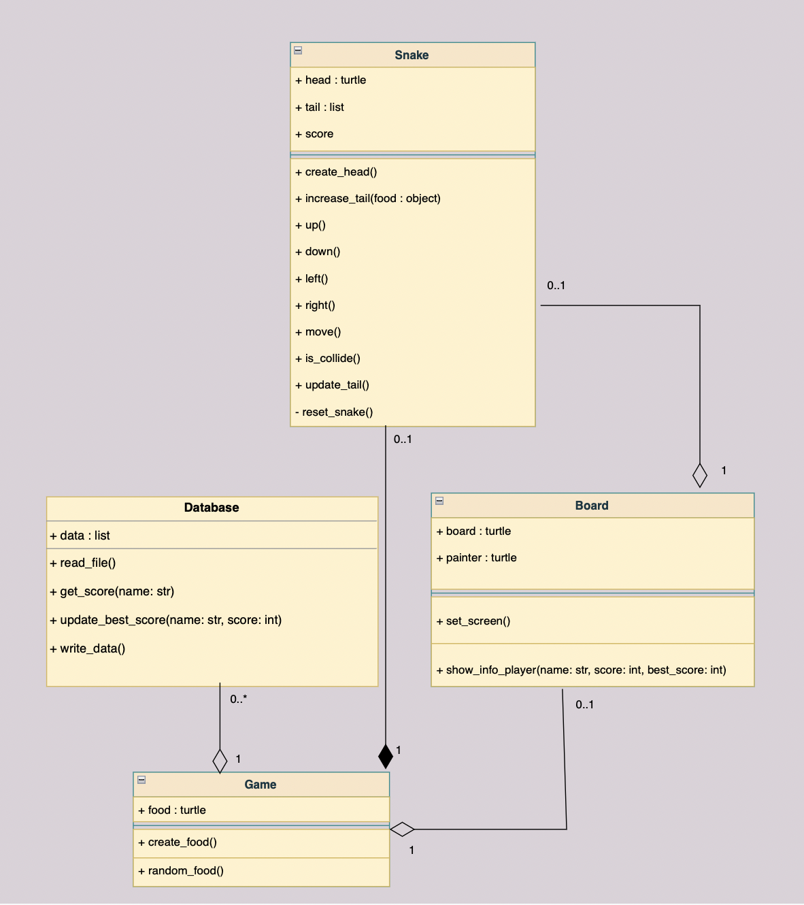

# HUNGRY SNAKE GAME

In this project, it's a graphical of Hungry Snake Game, as shown.

---
# Conditions

    The snake in the Snake game is controlled using the four direction buttons 
    relative to the direction it is headed in. 
    The objective of game is to achieve maximum points as possible by collecting foods. 
    And this game will over when the snake hits the wall or hits itself.

---
## Code Structure

My project application consists of five modules

### 1. Module `database.py`

This module contains the `Database` class for read and write file data.csv

### 2. Module `Board.py`

This module contains the `Board` class to set a screen of game then show name 
of player, score and best score

### 3. Module `Snake.py`
This module contains the `Snake` class for creating head and tail objects with
turtles and list of object.
Each tail object will update its own by index of list ,when a head of snake is 
in same position of food from `Game.py`.

### 4. Module `Game.py`
This module provides the `Food` class for creating random foods with using turtle.

### 5. Module `main.py`
This module implements an application all class from other module.

## Graphical Output

The graphical output it's implement the `draw` method in your `Snake.py` and
`Game.py`.  The `draw` method takes one `painter` argument which is a
`Turtle` object. [turtle](https://docs.python.org/3/library/turtle.html#turtle-methods)

* `tail` object is displayed with current list of object
* `food` object is displayed within the specified boundary.
* `Board` show name of player , score and best sore.

Enter name

start game

---

## Required libraries and tools

* [Python 3.9](https://www.python.org/downloads/)
---

## Program Design

All class of program
* `Database` : Database of game that write data into CSV file.
* `Board` : Displayed info of player 
* `Snake` : Create head and tail object
* `Food` : Create food of snake

---

   